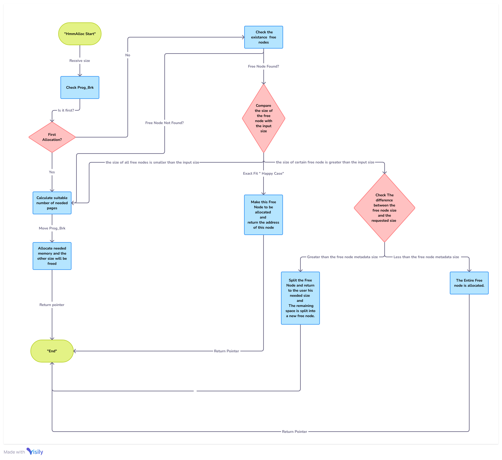
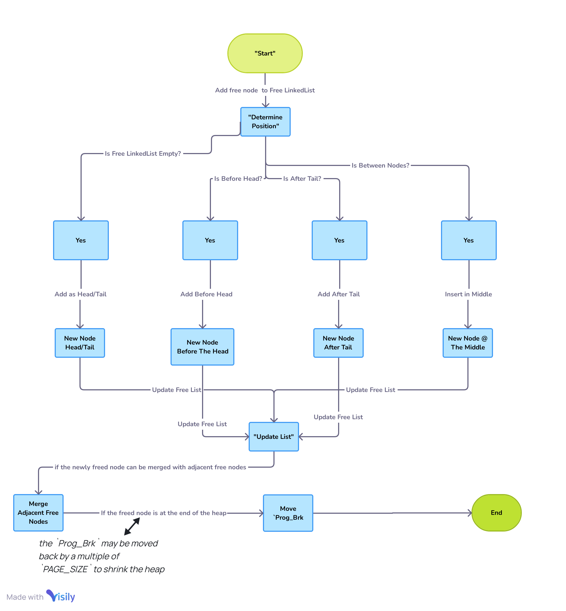

# Heap Memory Manager (HMM)

## Project Overview
This project implements a simple Heap Memory Manager (HMM) in C that provides dynamic memory allocation and deallocation services to user space programs. The HMM simulates a heap using a large statically allocated array and maintains memory blocks with a linked list.

---
## Features
- **Dynamic Memory Allocation**: Allocate memory blocks of varying sizes using `HmmAlloc(size_t size)`.
- **Memory Deallocation**: Free allocated memory blocks with `HmmFree(void *ptr)`.
- **Simulated Heap Management**: Simulate heap operations without kernel dependencies for easier debugging and testing.
- **Memory Optimization**: Minimize heap size increments/decrements to reduce overhead and improve performance.
---
## Installation and Compilation
To compile the project, you can use the provided Makefile or manually compile the code using the following command:

```bash
gcc  heap.c heap.h heap_mytst.c  heap_test
```

Run the program:

```bash
./heap_test
```

## How to Use it In Your Project
Include the `heap.h` header file in your program to use the HMM. Here's a simple example:

```c
#include "heap.h"

int main() {
    void *ptr = HmmAlloc(100);
    HmmFree(ptr);
    return 0;
}
```
---
## Design and Implementation Details

### Heap Structure
The Heap Memory Manager (HMM) simulates the heap using a statically allocated array. The heap size and page size are configurable through macros:
- **HEAP_SIZE**: Defines the total size of the heap (e.g., 1000 bytes).
- **PAGE_SIZE**: Defines the size of a page within the heap (e.g., 100 bytes).

The heap is managed using a linked list, where each node represents a free memory block.

### Program Break (`Prog_Brk`)
The `Prog_Brk` is a variable that simulates the end of the allocated heap. It moves by multiples of `PAGE_SIZE` whenever the heap needs to be extended or shrunk .

### Metadata Info
- **Allocated Node Metadata**: Each allocated block has 8 bytes of metadata, which stores the size of the block.
- **Free Node Metadata**: Each free block has 24 bytes of metadata, consisting of the size (8 bytes) and two pointers (16 bytes total) to the next and previous free nodes.

### `HmmAlloc` Function
The `HmmAlloc(size_t size)` function is responsible for allocating memory from the heap. The allocation process depends on several cases:

#### Case 1: First Allocation (Heap Initialization)
- When the program break (`Prog_Brk`) is at the start of the heap, this is the first allocation.
- **Challenge**: Determine how many pages to move the program break.
- **Solution**: The `Prog_Brk` will move by an amount that covers the requested size, plus the allocated metadata (8 bytes), and an additional free node metadata (24 bytes).
  - Example: If the user requests 90 bytes, the calculation will be `90 + 8 + 24 = 122 bytes`. The program break will move by 2 pages (200 bytes, assuming a `PAGE_SIZE` of 100 bytes).

#### Case 2: Reuse of Free Nodes
When there are already free nodes in the linked list, the function handles the following sub-cases:
1. **Exact Fit (Happy Case)**: A free node exactly matches the requested size.
2. **Larger Free Node**: A free node is found that is larger than the requested size.
   - **Sub-case A**: The difference between the free node size and the requested size is greater than the free node metadata size (24 bytes). The remaining space is split into a new free node.
   - **Sub-case B**: The difference is less than the free node metadata size, so the entire free node is allocated.
3. **Insufficient Free Space**: If all free nodes are smaller than the requested size, or if no free nodes exist, the `Prog_Brk` is moved to extend the heap.

### `HmmFree` Function
The `HmmFree(void *ptr)` function is responsible for freeing allocated memory and adding the block back to the free list. The function handles the following cases:

1. **Add to Free List**: The block is added to the free list, and its position is determined based on its address:
   - **Case A**: The new free node is located before the head of the free list.
   - **Case B**: The new free node is located between two existing nodes (middle of the list).
   - **Case C**: The new free node is located after the tail of the free list.
   - **Case D**: The free list is empty, so the new node becomes both the head and the tail.
   
2. **Merge Adjacent Free Nodes**: The function checks if the newly freed node can be merged with adjacent free nodes to form a larger block.
   
3. **Move `Prog_Brk`**: If the freed node is at the end of the heap, the `Prog_Brk` may be moved back by a multiple of `PAGE_SIZE` to shrink the heap.


### Flowcharts
#### HmmAlloc Function
The `HmmAlloc` function searches the free list for a suitable block. If a block is found, it is allocated; otherwise, the heap is extended.




#### HmmFree Function
The `HmmFree` function checks if the provided pointer is valid and then adds the block back to the free list, merging adjacent free blocks if possible.



---

## Debugging 

To facilitate testing and debugging, a macro called `DEBUG` has been added to the `heap.h` file. This macro controls the printing of debug statements throughout the code.

- **Enable Debugging**: To enable debug statements, set the `DEBUG` macro to `ON`. This will activate `printf` statements in each case of the program, allowing you to trace the execution and understand how memory is being managed.
  
  ```c
  #define DEBUG ON
  ```

- **Disable Debugging**: To disable debug statements, set the `DEBUG` macro to `OFF`. This will suppress the debug output, allowing the program to run without additional logging.

  ```c
  #define DEBUG OFF
  ```
  ---
## Testing
The project includes two test programs

### 1- (`stress_test.c`) 
- that simulates random allocation and deallocation scenarios. You can run this program to verify the correctness of the HMM implementation.
- You can run this program to verify the correctness of the HMM implementation 
```bash
gcc  heap.c heap.h  stress_test.c  heap_test
```

Run the program:

```bash
./heap_test
```


### 2- (`heap_mytst.c`)
- that simulates allocation and deallocation scenarios according to your input (it allows to you to intereact with the program by friendly user interface).

- You can run this program to verify the correctness of the HMM implementation(But don't forget to set the "DEPUG" Macro with "ON")
```bash
gcc  heap.c heap.h heap_mytst.c  heap_test
```

Run the program:

```bash
./heap_test
```

