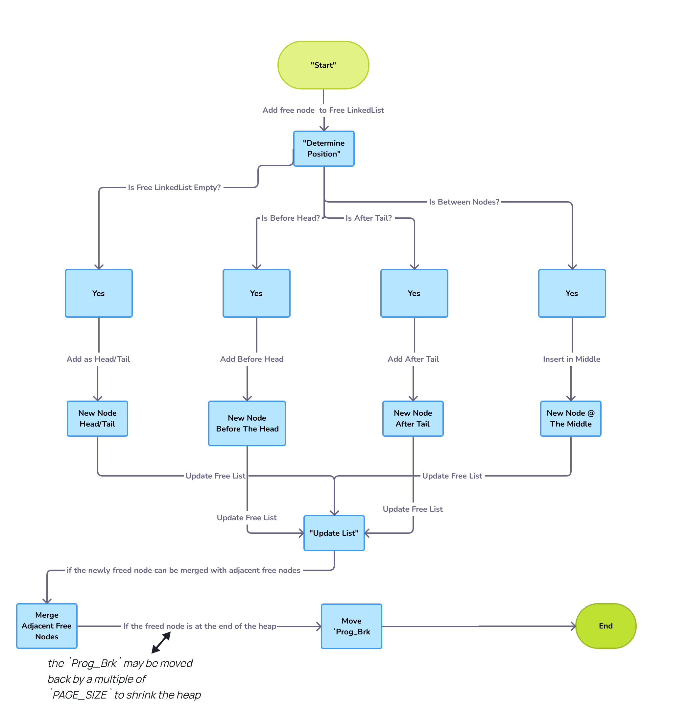

# Heap Memory Manager (HMM) - Phase 2

## Project Overview
This project extends the Heap Memory Manager (HMM) to replace the libc dynamic memory manager. The HMM now provides implementations of `malloc`, `free`, `calloc`, and `realloc`, utilizing the underlying HMM's `HmmAlloc()` and `HmmFree()` functions. The heap is managed using the system call `sbrk()` to allocate and deallocate memory directly from the operating system.

---
## Phase 1: Initial Implementation

The initial implementation of the Heap Memory Manager (HMM) was developed during Phase 1. This phase focused on creating the core functionality of the HMM, including dynamic memory allocation and deallocation using a simulated heap. For more details about Phase 1, you can refer to the original README [here](https://github.com/Mohamed100100/STMicroelectronics_Tasks/tree/master/Day6%20%5BMemory%20Allocation%5D).

---

## Features of Phase 2
- **Dynamic Memory Allocation**: Use 

`malloc(size_t size)`, `calloc(size_t nmemb, size_t size)`, and `realloc(void *ptr, size_t size)` to allocate memory dynamically.
- **Memory Deallocation**: Free allocated memory blocks with `free(void *ptr)`.
- **Heap Management**: Use `sbrk()` to manage the heap, minimizing the number of system calls to reduce overhead.
- **Shared Library**: The HMM is compiled as a shared library, allowing it to be preloaded and used by existing Linux programs.
- **Optimized Memory Usage**: The implementation minimizes memory allocation to prevent out-of-memory issues when the HMM is used by multiple programs.

---

## Installation and Compilation

### Manual Compilation

If you prefer to compile the project manually, you can do so with the following commands:

1. Compile the HMM library:
   ```bash
   gcc --shared -fPIC -o libhmm.so heap.c heap.h
   
   ```

2. Run a program with the HMM library preloaded:
   ```bash
   LD_PRELOAD=./libhmm.so ls
   ```

---

## How to Use the HMM Library

Include the `heap.h` header file in your program to use the HMM. Here's a simple example:

```c
#include "heap.h"

int main() {
    void *ptr = malloc(100);
    free(ptr);
    return 0;
}
```

To use the HMM with existing programs, preload the shared library as shown in the Installation and Compilation section.

---

## Design and Implementation Details

### Heap Structure
The Heap Memory Manager (HMM) uses `sbrk()` to request memory from the operating system. The heap is managed with a linked list, where each node represents a free  memory block.

### Program Break (`Prog_Brk`)
The `Prog_Brk` is managed by the `sbrk()` system call. It moves by multiples of the `PAGE_SIZE` to allocate or free memory.

### Memory Allocation Functions
- **`malloc(size_t size)`**: Allocates a memory block of the requested size. It uses `HmmAlloc()` internally to find or allocate a suitable block.
- **`calloc(size_t nmemb, size_t size)`**: Allocates memory for an array of `nmemb` elements, each of size `size`, and initializes it to zero.
- **`realloc(void *ptr, size_t size)`**: Resizes the memory block pointed to by `ptr` to the new size. If the new size is larger, the additional memory is uninitialized.
- **`free(void *ptr)`**: Frees the memory block pointed to by `ptr` and adds it back to the free list.

### `HmmAlloc` and `HmmFree` Functions
These functions form the core of the HMM, managing the allocation and deallocation of memory blocks.

#### `HmmAlloc`
- **First Allocation**: Initializes the heap using `sbrk()` if it hasn't been initialized.
- **Reuse of Free Nodes**: Reuses existing free nodes in the linked list if possible.
- **Heap Extension**: Extends the heap using `sbrk()` when necessary.

#### `HmmFree`
- **Add to Free List**: Adds the freed block to the free list in a sorted order.
- **Merge Adjacent Free Nodes**: Merges adjacent free blocks to reduce fragmentation.
- **Shrink Heap**: Shrinks the heap by moving `Prog_Brk` backward if the last block is free.

### Optimizations
- **Minimized `sbrk()` Calls**: The implementation minimizes the number of `sbrk()` calls to reduce overhead.
- **Memory Usage Optimization**: The amount of memory allocated to the HMM is minimized to prevent out-of-memory issues.

---
## Flowcharts

### HmmAlloc Function
The `HmmAlloc` function searches the free list for a suitable block. If a block is found, it is allocated; otherwise, the heap is extended.


### HmmFree Function
The `HmmFree` function checks if the provided pointer is valid and then adds the block back to the free list, merging adjacent free blocks if possible.



---
## Debugging

To facilitate testing and debugging, a macro called `DEBUG` has been added to the `heap.h` file. This macro controls the printing of debug statements throughout the code.

- **Enable Debugging**: Set the `DEBUG` macro to `ON` to activate `printf` statements and trace memory management operations.
  
  ```c
  #define DEBUG ON
  ```

- **Disable Debugging**: Set the `DEBUG` macro to `OFF` to suppress debug output.

  ```c
  #define DEBUG OFF
  ```

---

## Testing

The project includes two test programs:

### 1. `stress_test.c`
- Simulates random allocation and deallocation scenarios to verify the correctness of the HMM implementation.
- Compile and run:
  ```bash
  gcc heap.c stress_test.c -o stress_test
  ./stress_test
  ```

### 2. `heap_mytst.c`
- Simulates allocation and deallocation scenarios according to your input, providing an interactive user interface.
- Compile and run:
  ```bash
  gcc heap.c heap_mytst.c -o heap_test
  ./heap_test
  ```

### Testing with Linux Programs
- Preload the HMM library and test it with existing Linux programs:
  ```bash
  LD_PRELOAD=./libhmm.so ls
  LD_PRELOAD=./libhmm.so vim
  ```

---

## Video Demonstration
A short video  is available, showing the design of the HMM and the testing conducted. It provides an overview of how the HMM works, including the optimizations and challenges faced during implementation You can watch the video [here](https://drive.google.com/file/d/1gshA2onWu1JogNDPUIF_v66GbMwQgHEu/view?usp=sharing).


---


